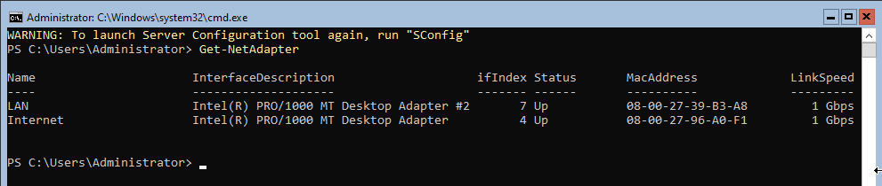
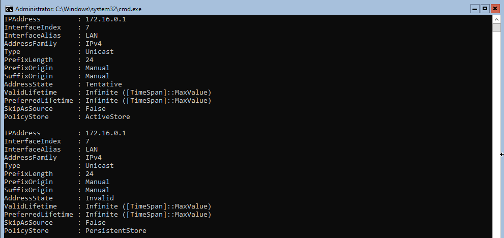
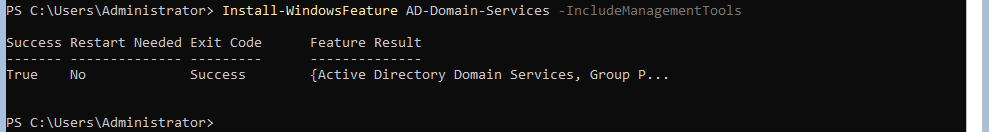
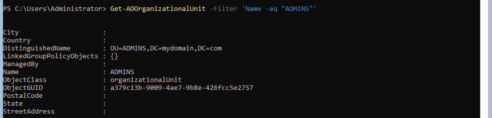
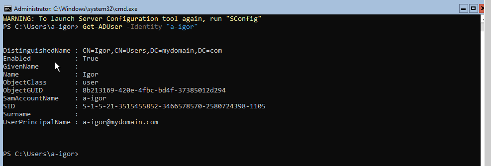
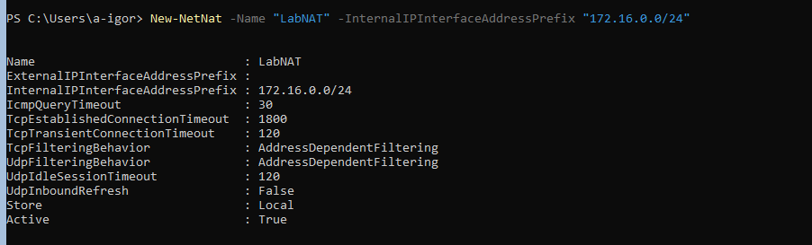
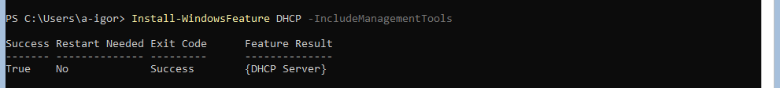
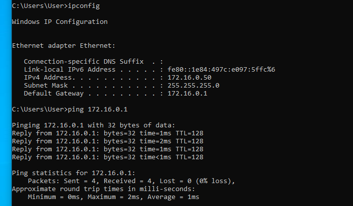

# 🏗️ Windows Server Core - Active Directory Home Lab

  

## 🎯 Project Overview
This project documents the deployment of a complete **Active Directory Domain Services (AD DS)** environment using **Windows Server Core** (headless version).

The main objective is to simulate a real-world enterprise scenario where server resources are optimized, and management is performed primarily via **PowerShell** and **CLI**, rather than the GUI. This project focuses on automation and "Infrastructure as Code" principles.

### 🛠️ Tech Stack
* **Hypervisor:** Oracle VirtualBox
* **Operating System:** Windows Server 2022 Core
* **Tools:** PowerShell, SConfig
* **Python 3:** Scripting for bulk data generation and automation logic (e.g., generating user lists for AD import).
---

## ⚙️ Configuration Log

Below are the initial steps taken to provision the server.

### 1. Network Interface Management
The first step was to inspect and organize the network interfaces. I needed to distinguish between the NAT adapter (Internet access) and the Internal adapter (Lab network).

I used PowerShell to list the adapters, identify them by IP/MAC, and assign descriptive names.

**PowerShell Command:**
```powershell
# 1. Inspect current network adapters (to identify NAT vs Internal)
Get-NetAdapter

# 2. Rename the NAT adapter (Internet Access)
Rename-NetAdapter -Name "Ethernet" -NewName "Internet"

# 3. Rename the Internal Network adapter (Lab Environment)
Rename-NetAdapter -Name "Ethernet 2" -NewName "LAN"

# 4. Verify the new configuration
Get-NetAdapter
```


The second step was to configured the internal network adapter (`LAN`) with a static IPv4 address and set the DNS server to localhost (Loopback). This is a critical step for promoting the server to a Domain Controller.

* **IP Address:** `172.16.0.1`
* **Subnet Mask:** `255.255.255.0` (/24)
* **DNS Server:** `127.0.0.1`

**PowerShell Command:**
```powershell
#1. setting ip and mask
New-NetIPAddress -IPAddress "172.16.0.1" -InterfaceAlias "LAN" -PrefixLength 24
```


**PowerShell Command:**
```powershell
#1. setting DNS
Set-DnsClientServerAddress -InterfaceAlias "LAN" -ServerAddresses ("127.0.0.1")
```


### 2. Changing the hostname
I renamed the server to follow a standard naming convention (DC01) to ensure easy identification and management within the network infrastructure.

**PowerShell Command:**
```powershell
#1. Rename computer and force restart
Rename-Computer -NewName "DC01" -Restart
```
## After restart host name is DC01


### 4. Active Directory Deployment (Domain Controller)
I installed the Active Directory Domain Services (AD DS) role and promoted the server to a Domain Controller, establishing a new forest named `mydomain.com.local`.

**PowerShell Commands:**
```powershell
# 1. Install AD DS Role and Management Tools
Install-WindowsFeature AD-Domain-Services -IncludeManagementTools

# 2. Promote Server to Domain Controller (Create New Forest)
# Note: You will be prompted for the Safe Mode Administrator Password
Install-ADDSForest -DomainName "mydomain.com" -InstallDns
```




### 5. Post-Deployment User Security
To enhance security and follow best practices, I moved away from using the default built-in `Administrator` account. I created a personalized administrative user and granted it elevated privileges by adding it to the **Domain Admins** group.

The first step is to create a new folder just for admins to better manage users in the future.

**PowerShell Commands:**
```powershell
#1 Creating a ADMINS folder
Get-ADOrganizationalUnit -Name "ADMINS"
```


The second step was to create a new administrator account. I defined a variable for the password to ensure security, created the user directly in the ADMINS folder, and assigned the necessary administrative privileges.

**PowerShell Commands:**
```powershell
#2. Creating a Secure Password Variable
$Password = ConvertTo-SecureString "YourStrongPassword123!" -AsPlainText -Force

#3. Creating the New Admin User in the ADMINS OU
New-ADUser -Name "Igor Admin" `
           -SamAccountName "adm.igor" `
           -UserPrincipalName "adm.igor@mydomain.com" `
           -AccountPassword $Password `
           -Enabled $true `
           -PasswordNeverExpires $true `
           -Path "OU=ADMINS,DC=mydomain,DC=com"

#4. Granting Administrative Privileges
Add-ADGroupMember -Identity "Domain Admins" -Members "adm.igor"
Add-ADGroupMember -Identity "Administrators" -Members "adm.igor"
```

Finally, to confirm that the account works and has the correct permissions, I logged off from the current session.

**PowerShell Commands:**
```powershell
logoff
```


### 6. NAT & Routing Configuration

To allow client machines (like Windows 10) on the internal network to access the Internet, I configured the server to act as a Router using NAT (Network Address Translation).

Since I am using Server Core, I performed the installation and configuration purely via code. I utilized PowerShell to install the roles and netsh to map the specific network interfaces created in Step 1.

* External Interface: Internet (Mode: Full/Public)

*  Internal Interface: LAN (Mode: Private)


**PowerShell Commands:**
```powershell
# 1. Install Routing support (Enables packet forwarding capability)
Install-WindowsFeature Routing

# 2. Create the NAT Rule
# This creates a gateway for the entire 172.16.0.0/24 subnet.
# Any traffic from the LAN will be translated to the external IP automatically.
New-NetNat -Name "LabNAT" -InternalIPInterfaceAddressPrefix "172.16.0.0/24"
```


### 7. DHCP Server Configuration
To eliminate the need for manual IP configuration on client workstations, I installed and configured the DHCP Server role.

The server now automatically provides network configuration to any device connecting to the internal switch. I created a scope called "BiuroLAN" with the following parameters:

* IP Address Pool: 172.16.0.50 to 172.16.0.200 (leaving lower IPs  for static servers).

* Subnet Mask: 255.255.255.0.

* Default Gateway (Option 003): 172.16.0.1 (Points to this server to allow Internet access via NAT).

* DNS Server (Option 006): 172.16.0.1 (Points to this server to resolve Active Directory domain names).

**PowerShell Commands:**
```powershell
# 1. Install DHCP Role
Install-WindowsFeature DHCP -IncludeManagementTools

# 2. Authorize DHCP in Active Directory
Add-DhcpServerInDC -DnsName "DC01" -IPAddress 172.16.0.1

# 3. Create Scope & Set Network Options
Add-DhcpServerv4Scope -Name "BiuroLAN" -StartRange 172.16.0.50 -EndRange 172.16.0.200 -SubnetMask 255.255.255.0 -State Active
Set-DhcpServerv4OptionValue -ScopeId 172.16.0.0 -OptionId 3 -Value 172.16.0.1 # Gateway
Set-DhcpServerv4OptionValue -ScopeId 172.16.0.0 -OptionId 6 -Value 172.16.0.1 # DNS
```


### 8. Automating User Data Generation with Python

To simulate a realistic enterprise environment, I needed to populate Active Directory with a significant number of user accounts. Instead of manual entry, I developed a Python automation script to generate synthetic user data.

I used the Faker library for realistic Polish names, csv for data formatting, and the os library to ensure robust file path handling.

🛠️ Environment Setup
I followed Python best practices by isolating the project in a virtual environment:

* Created a dedicated directory: python_script/

* Initialized a virtual environment: python -m venv venv

* Installed dependencies: pip install Faker

* Freezed dependencies: pip freeze > requirements.txt

📄 The Generator Script (script.py)
This script generates 100 unique users and saves them to names.csv. I implemented the os module to dynamically determine the script's location, ensuring the output file is always saved in the python_script/ directory, regardless of where the command is executed from.

**Python Script:**
```python
from faker import Faker
import csv
import os


fake = Faker('pl_PL')

current_folder = os.path.dirname(os.path.abspath(__file__))
file_path = os.path.join(current_folder, 'names.csv')


with open(file_path, 'w', newline='', encoding='utf-8-sig') as csvfile:
    fieldsnames = ['firstName', 'lastName']
    writer = csv.DictWriter(csvfile, fieldnames=fieldsnames)
    writer.writeheader()
    for i in range(100):
        first_name = fake.first_name() 
        last_name = fake.last_name()
        writer.writerow({'firstName': first_name , 'lastName': last_name})
```

📊 Output Verification
The script produces a standard CSV file (names.csv) ready for bulk import into Active Directory:

```csv
firstName,lastName
Piotr,Pierzak
Maciej,Faruga
Patryk,Andrejczuk
Dorota,Zawartka
```

Key Takeaways:
* Automation: Replaced manual work with a scalable script.
* Robustness: Used os.path to prevent file location errors.
* Standardization: Used CSV format as a universal data exchange standard.

9. Automated Bulk User Onboarding
Ideally, this process utilizes a Python script to generate a large dataset of users, which is then transferred to the server. However, due to the strict isolation of the Server Core environment (simulating an air-gapped or high-security datacenter) and restrictions on clipboard/file sharing, I implemented a local data injection strategy.

Instead of downloading a compromised HTML file via Invoke-WebRequest, I generated the CSV payload directly on the server's file system before executing the provisioning logic.

# Process Workflow:

* Local Data Injection: Created the users.csv dataset directly on the local disk using PowerShell pipeline redirection, bypassing network restrictions.

* Credential Security: Defined a standard initial password for all new accounts (Password123!) converted to a SecureString.

* Bulk Provisioning: Looped through the local CSV dataset using Import-Csv and piped the data into the New-ADUser cmdlet.

* Logic & Mapping: Automatically generated the SamAccountName (login) format as firstname.lastname and mapped attributes to the Domain Controller.

**PowerShell Script:**
```powershell
# 1. Local Data Generation (Workaround for isolated/air-gapped environment)
# Generating a dataset directly on the C: drive to bypass transfer restrictions
"firstName,lastName","Piotr,Pierzak","Marek,Admin","Jan,Testowy" | Set-Content C:\Users\a-igor\users.csv

# 2. Secure Password Definition
$pass = ConvertTo-SecureString "Password123!" -AsPlainText -Force

# 3. Bulk Creation Loop
Import-Csv "C:\Users\a-igor\users.csv" | ForEach-Object {
    
    # Generate login: firstname.lastname
    $samAccount = ($_.firstName + "." + $_.lastName).ToLower()
    
    # Create AD User
    New-ADUser -Name "$($_.firstName) $($_.lastName)" `
               -SamAccountName $samAccount `
               -UserPrincipalName "$samAccount@mydomain.com" `
               -GivenName $_.firstName `
               -Surname $_.lastName `
               -AccountPassword $pass `
               -Enabled $true `
               -Path "CN=Users,DC=mydomain,DC=com"
}
```


## 10. Client Workstation Configuration & Connectivity

To simulate a real-world corporate environment, a client machine running **Windows 10 Pro** was deployed. The goal was to establish a connection between the workstation and the Windows Server Core (Domain Controller) within an isolated network.

### Network Configuration Steps:
1.  **Virtualization Network:**
    * Configured the Network Adapter to **Internal Network** mode (using the same tag: `intnet`) to ensure physical isolation from the public internet and direct connection to the server.
2.  **Static IP Configuration:**
    * Manually assigned an IPv4 address to ensure stability and connectivity before Domain Join.
    * **IP Address:** `172.16.0.20`
    * **Subnet Mask:** `255.255.0.0`
    * **Default Gateway:** `172.16.0.1` (Server IP)
    * **Preferred DNS:** `172.16.0.1` (Crucial step: Pointing DNS to the Domain Controller allows the client to resolve the domain name).

### Connectivity Verification (Ping Test)
Performed a `ping` test from the Client machine to the Server (`172.16.0.1`).
* **Result:** Successful reply (`Reply from 172.16.0.1...`).
* **Conclusion:** The internal network routing is functioning correctly, and the client can communicate with the Domain Controller.



## 11. Domain Join & Final Integration

The final phase of the project involved promoting the client workstation from a standalone workgroup member to a fully managed resource within the **mydomain.com** Active Directory environment.

### Execution Steps:
1.  **Domain Membership Change:**
    * Accessed `System Properties` on the client machine.
    * Changed member status from `WORKGROUP` to **Domain**: `mydomain.com`.
2.  **Authorization:**
    * Provided Domain Administrator credentials when prompted, proving that the client could communicate with the Domain Controller and authenticate privileges.
3.  **Success Confirmation:**
    * Received the system confirmation message: **"Welcome to the mydomain.com domain."**
    * This confirms that DNS resolution, network routing, and AD permissions are all configured correctly.


### User Login Verification
Following the required system restart, the connectivity was tested from the user's perspective.
* **Action:** Attempted login using the Active Directory user account created in previous steps.
* **User:** `Piotr Pierzak` (Logon: `mydomain\Piotr.Pierzak`)
* **Result:** Successful authentication and profile creation. The user can now log in to the workstation using credentials managed centrally by the Windows Server Core.

---
**Project Status:** COMPLETED ✅